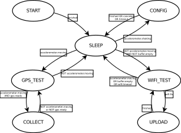

= Firmware design

== Diagram

== States

== Tasks

== Pseudo-code

=== GLOBAL

----
Create accelerometer sensor object
Create barometer sensor object
Create buzzer object
Create gps sensor object
Create humidity sensor object
Create led object
Create particulate sensor object
----

=== SETUP

----
Set STATE to START

Setup serial output

Create running accelerometer task (1s)
Create suspended barometer task (1m)
Create suspended gps task (1s)
Create suspended humidity task (1m)
Create suspended particulate task (30s)

Set STATE to SLEEP
----

=== LOOP

----
if STATE == SLEEP:

    if accelerometer.move == True:
        Set STATE to GPS_START
        Start GPS task

        Set STATE to GPS_TEST

    else:

        if buffer.empty == False:
            Set STATE to WIFI_START
            Start Wifi task

            Set STATE to WIFI_TEST

elif STATE == CONFIG:

elif STATE == GPS_TEST:

    if accelerometer.move == True:
        if gps.ready == True:
            Set STATE to COLLECT_START
            Start sensor tasks

            Set STATE to COLLECT

    else:
        Set STATE to GPS_STOP
        Stop GPS task

        Set STATE to SLEEP

elif STATE == COLLECT:

    Write sensor data

    if accelerometer.move == False or gps.ready == False:
        Set STATE to GPS_TEST

elif STATE == WIFI_TEST:

    if wifi.fix == True:
        Set STATE to UPLOAD

    if buffer.empty == True or wifi.timeout = True:
        Set STATE to WIFI_STOP
        Stop Wifi task

        Set STATE to SLEEP

elif STATE == UPLOAD:

    // Upload action finishes successfully or times out
    Create JSON of X records
    Send to Server

    Set STATE to WIFI_TEST

led.update()

scheduler.tick()
----

image::http://ik-adem.be/wp-content/themes/adem/assets/images/adem_logo.svg[alt="ADEM logo", link="http://ik-adem.be/", align="right"]
